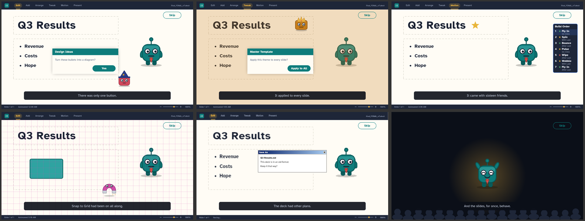

# Death by Slides

[](https://github.com/AIvocado633/DeathBySlides/actions/workflows/ci.yml)

A 2D mobile game about defeating the presentation-software features that
defeated you.

Each level is a slide. Each boss is a feature — Shrink-to-Fit, the Diagram
Wizard, the Master Template, the Build Order, Snap to Grid, and finally the
Legacy Format. You fight them from a top-down
view inside the slide, with a character built out of autoshapes.

The game takes place inside a made-up slide editor with a look of its own —
ink-navy chrome, warm paper slides, a teal accent, and the Braille Institute's
[Atkinson Hyperlegible](https://www.brailleinstitute.org/freefont/) typeface
(SIL Open Font License, see `assets/fonts/OFL.txt`) — so it is about slideware in
general, not a homage to any one product. It is not affiliated with or endorsed
by the makers of any presentation software.

Built with Flutter and the [Flame](https://flame-engine.org) engine.

## Status

All six slides are playable end to end.

- **Start menu** — a title slide in the editor's normal view, with toolbar,
  status bar, dashed placeholders and staggered fly-in entrances.
- **Light Table** — level select, showing all six slides (see *Progression*
  below).
- **Slide show** — six fights: Shrink-to-Fit, the Diagram Wizard, the Master
  Template, the Build Order, Snap to Grid and the Legacy Format, with
  twin-stick controls (see below).
- **Tweaks** — settings for controls, motion and sound, and **Pep Talk**, the
  optional assists (see below).
- **Sound** — effects for every shot, hit and win, and music for menus and
  fights (see *Sound* below).

### The intro

The first launch opens on the night before: twenty seconds, five scenes. A
blank slide at 11:58 PM with a presentation at 9; Shrink-to-Fit, the Diagram
Wizard and the Master Template each wrecking it in turn; the news that the
deck was last saved in 2003; and the view zooming into the slide, presenter
and all, before the title card. It plays once — *Skip*, or any tap, key or
button after its first second, ends it — and *The Night Before*, under the
presenter on the title slide, plays it again. With Reduce Motion the scenes
keep their timing but nothing moves.

### Between slides

The night goes on between the slides. After each win, on the way into the next
slide, a scene of about eight seconds plays. The clock moves on, the beaten
feature is gone, and the next one turns up: the Design Ideas dialog with only
one button, a theme applied to every slide, one animation that came with
sixteen friends, a box that won't stay put, and a save dialog from 2003. The
last win leads into 8:59 AM, with the presenter walking on stage, before the
end of the show.

Each scene plays once, whether you go on with *Next Slide* or from the light
table. Retrying a slide never plays one. *Skip* works as it does in the intro.
*The Night Before* replays the intro and then every scene seen so far.



### Progression

The deck is played in order. Slide 1 is always open; every other slide opens
once the one before it is won, and stays open, because wins are saved on the
device. Any slide you have opened can be replayed.

- **Light Table** — each thumbnail shows where its slide stands: a star
  under a slide you have beaten (the mark slide editors give slides with
  animations), a plain slide when it is open, a greyed-out slide with a bolt
  when it is locked, and a faded *hidden slide*, number struck through, when
  its boss has not been built yet.
- **Winning** a slide offers **Next Slide** first, then Retry Slide and Walk
  Off.
- **Winning the last slide** ends the show the way every slide show ends: a
  black screen reading *End of slide show, click to exit.*, with the credits
  in its speaker notes. Any tap, key or button goes back to the title slide,
  which now knows the deck is done — the status bar reads *Slide 6 of 6 ·
  Presented*, nothing stands between you and the end of the deck, and the
  presenter is, for once, pleased with itself. Being done is just every slide
  won, so it is saved with the wins, and every slide can still be replayed.
- **Start menu** — *Start Presenting* (F5) on a fresh deck. Once you have won
  something it becomes *Carry On* (Shift+F5) and opens the first
  slide you have not won yet, which is also the slide the status bar shows.
  The footer counts down the features still in the way.

### Best times

Every fight is timed the way a rehearsal times a slide: from the moment the
fight starts to the moment the feature goes down, leaving out its exit and
any time spent paused.

- **Winning** reports it on the dialog, `Slide time 00:42 · Best 00:37`, or
  calls out a new best. A slower run never replaces a best.
- **The light table** shows each beaten slide's best across from its number,
  where a slide sorter shows a slide's rehearsed timing.
- **The end of the show** gives the last slide's time, and the whole deck's
  once every slide has one.
- A run with any **Pep Talk** assist on counts like any other, and is marked
  `(Pep Talk)` wherever it shows.

Best times are saved with the wins.

### Controls

Twin-stick: one input moves, the other aims, and pushing the aim in any
direction fires that way immediately — there is no fire button.

|           | Touch             | Keyboard                         | Controller          |
| --------- | ----------------- | -------------------------------- | ------------------- |
| **Move**  | left thumb stick  | WASD                             | left stick          |
| **Aim**   | right thumb stick | arrow keys                       | right stick         |
| **Menus** | tap               | arrows, Enter or Space, Esc      | D-pad or left stick, A, B |
| **Pause** | Pause chip        | B or `.`                         | Start               |

All three work at once, so you can pick up a controller mid-fight.

Menus work without touching the screen. Arrows, the D-pad or the left stick
move focus, drawn as a shape selection; the light table moves across its
grid. Enter, Space or A chooses, and Esc or B goes back. On the start menu,
F5 starts the show from the beginning and Shift+F5 from the current slide, as
in most presenting software. Mid-fight, Esc or B opens the pause menu (see below). On
Android the back gesture goes back a step — during a fight it pauses instead —
and only leaves the app from the title slide.

### Pausing

During a real presentation, **B** blanks the screen until you press it again, so
that is what pausing looks like: the fight freezes behind a black slide
offering Resume, Retry Slide and Walk Off. `.`, controller **Start** and the
**Pause** chip do the same.

Nothing advances while paused — movement, shot cooldowns, boss timers and
shots already in the air all stop together, because the whole board is one
frozen time scale — and resuming never fires a shot queued behind the menu.

Leaving a fight takes two steps now: Esc, back or the **Walk Off** chip opens
the pause menu with Walk Off already chosen, so one stray tap or key press
cannot lose a fight. Pressing Esc again ends it, as in any slide show.

The fight also pauses itself when the app goes away — a notification, a call,
another app, or a desktop window losing focus — and stays paused on the way
back, so nobody returns mid-dodge. Space still
fires along the way you are walking, for anyone who would rather not aim.
Controllers come through the Flame team's
[`gamepads`](https://pub.dev/packages/gamepads) package, whose normalized
events map every platform's pad onto the same Xbox-style layout.

Each fight is built out of the feature's own behaviour rather than out of a
health bar with a new sprite on it.

### Tweaks

Settings live in the editor's Tweaks panel, built from its own controls:
dialog checkboxes, and sliders borrowed from the status bar's zoom slider,
which finally does something. Everything can be reached with arrows, the D-pad
or the left stick — left and right move a focused slider — and every change is
saved and applied the moment it is made.

- **Swap sticks** moves on the right thumb and aims on the left, for
  left-handed players. Touch only: keys and controller sticks stay put.
- **Controller dead zone**, 5–40%, 20% by default: how far a stick must travel
  before it counts. Raise it if a worn stick walks the player on its own.
- **Thumb stick size**, 80–125%, for small phones or big thumbs.
- **Reduce Motion** stills everything that is only decoration: fly-in
  entrances (things simply appear), the drifting autoshapes on the title
  slide, the actors' idle bob, and every hit flash, squash and shake. The
  fight itself — walking, shots, bosses moving — is untouched. Until the
  player chooses, it follows the device's own setting (Android's *Remove
  animations*), checked again whenever the app comes back.
- **Music** and **Effects**, 0–100%, 50% and 80% by default. *Off* really is
  off: nothing of that side is loaded or played. The effects slider plays a
  shot at the new level, so it can be set by ear.

### Pep Talk

The fights are fast twin-stick dodging, which not everyone can do. Pep Talk,
opened from Tweaks, is a handful of assists rather than one "easy mode", each
switched on on its own:

- **More room to shrink** — 12 hits instead of 8 before the slide is lost. The
  smallest size is the same, so each hit costs less size, and size still maps
  to speed the same way.
- **Slower shots** — everything thrown at you flies at 70% speed.
- **Longer grace** — twice as long untouchable after a hit.
- **Aim assist** — bullet points bend gently (at most 90° a second) towards a
  target within 30° of where they are heading. It rescues a near miss; it does
  not aim for you.

Nothing is held back: a slide won with Pep Talk counts like any other, and the
fight just says *Pep Talk is on* under its title. Each assist is applied in one
place — the player's health, the `EnemyShot` base class, the player's grace
window and the bullet point's flight (`lib/game/combat/pep_talk.dart`) — so
every boss gets them without doing anything. A new boss only marks what the
player should hit with `BulletTarget`, so aim assist can find it. Tweaks cannot
be opened mid-fight, so a change always applies from the next slide.

### Sound

The game borrows the idea of the stock animation sounds every slide editor
once shipped with — a click for each bullet point fired, a whoosh as a page
flies in, a drum roll into a fight, applause for a win and something
deflating for a loss — and each boss brings its own hits and defeat. Music is
a hold-music loop for the menus and the same slightly too cheerful template,
faster, for fights.

Every file is original: `tool/make_sounds.py` synthesises them all, and
[`assets/audio/CREDITS.md`](assets/audio/CREDITS.md) lists each one with its
licence (CC0). Rebuild them with `python tool/make_sounds.py` (needs numpy).

- Music pauses with the fight, and whenever the app is in the background.
- A fight loads its sounds as the slide opens, so the first shot is heard
  without a delay.
- Each cue has a cap on how many copies sound at once, so a stream of shots
  stays a rhythm rather than a roar.
- Everything goes through `lib/game/audio/game_audio.dart`; the platform sits
  behind `AudioBackend`, and tests swap in a fake that records what played.

### Slide 1 — Shrink-to-Fit

Shrink-to-Fit shrinks whatever does not fit, so the fight turns that on both
sides. Every hit the boss lands makes the player smaller; every bullet point
that lands steps the boss down a ladder of point sizes, the way text shrinks
when it overflows its box, from 54 pt to nothing. Whoever runs out of size first loses
the slide.

Shrinking is not purely a punishment. A smaller player is quicker and a
narrower target, and can squeeze closer to the walls — the trade is that you
have less room left to lose.

### Slide 2 — Diagram Wizard

The Diagram Wizard is not one target but six connected shapes. Break one and the
survivors immediately re-lay themselves out into the next layout — cycle,
process, hierarchy, pyramid — closing ranks and throwing your aim away, which
is exactly what an auto-diagram does to a slide the moment you add or remove a
line.
It fights back by throwing its connector arrows at you.

Where Shrink-to-Fit is one target that gets smaller, the Diagram Wizard is
many targets that
keep moving: same controls, a completely different problem.

### Slide 3 — Master Template

Change the template and every slide built on it changes too, whether you
wanted that or not. The Master Template is one fight whose rules keep
changing — and they change for you as much as for it.

Every seven seconds it applies a new theme to the whole slide. *Applying
theme…* and a filling bar across the top of the arena give a second and a half
of warning; then, in the same frame, the floor changes, its shots change, your
shots change, and every shot already in the air on both sides converts on the
spot. Each theme is a trade-off for both sides:

| Theme | Your bullet points | Its swatches |
| --- | --- | --- |
| **Plain** | as tuned | as tuned |
| **Rebound** | bounce off one wall | bounce off one wall |
| **Sleek** | faster, thinner | curve |
| **Chunky** | big and slow: easy to land | big and slow: hard to dodge |

Its health is its five layouts, hanging off the master (`5 layouts`). Each
takes three hits and is stripped off; the master is locked until the last one
is gone — shots meant for it fly straight past — and then takes four more.
Closing it puts the slide back to Plain.

The rules reach the player through `BossContext.setPlayerShotRules`, and shots
in flight through `Projectile.applyRules`, so the boss never touches the player
and no shot is ever respawned.

### Slide 4 — Build Order

A numbered list of effects, each with a trigger, and a play order nobody can
predict. The Build Order docks beside the arena and lists the attacks to come,
in order — `1 ★ Fly In · On Click`, `2 ★ Spin · With Last`, … — with the star
coloured by kind: green for an entrance, yellow for an emphasis, red for an
exit. Each step is an attack named after its effect: *Fly In* sweeps shots in
from one edge, *Spin* is a spiral, *Pulse* an expanding ring with a gap,
*Wipe* a wall with one way through, *Bounce* shots off the walls, and *Wobble*
a curving stream.

The triggers mean what they say:

- **After Last** plays once everything before it has finished.
- **With Last** plays alongside the step before it.
- **On Click** plays when you click — and **every bullet point you fire is a
  click**. Hold the aim down and you set off every On Click attack in the
  queue.

Its health is the list: 17 steps (`17 animations`), each with a numbered tag
floating over the arena that shows where it stands in the queue. Two hits on a
tag delete its step. Every three deletions the queue reorders itself, so the
list you have been reading changes under you. Emptied, it is beaten; beaten
by it, you fly out, off the top of the slide.

The other fights reward shooting all the time. This one rewards reading the
queue and choosing when. The queue and its triggers are plain data with a pure
scheduler (`lib/game/combat/build_queue.dart`), and the arena tells any boss
that wants to know when the player fires (`Boss.onPlayerFired`).

### Slide 5 — Snap to Grid

Drag a shape and Snap to Grid drops it on the nearest gridline: close to where
you meant, never exactly there. In this fight the arena is the enemy.

- **You snap.** While it is on, the player lands on the nearest grid crossing.
  Input stays analogue — it moves where you *mean* to be, continuously — but
  what is drawn and what gets hit is snapped, so movement becomes a series of
  deliberate hops.
- **It strikes along the lines.** The boss is a small grid dialog roaming the
  arena, snapping as it goes. Every couple of seconds it marks rows and
  columns with dashed alignment guides — always your own row or column among
  them — and after a warning they strike. Snapped, you are always on a line,
  so dodging means reaching a different line in time. Pep Talk's slower shots
  give the guides longer to read.
- **Its health is the grid spacing**, which the floor draws and you snap to
  alike: `Spacing 2 cm`, then 1.5, 1.25, 1, 0.75, 0.5 and 0.25 cm, three hits
  each. Coarse means few lanes and chunky hops; fine means more lanes to watch
  but smoother movement. Run it out and snapping is `Off`.

Nothing new to aim at: the challenge is moving in a new way. A feature can
constrain movement through `BossContext.setPlayerPositionFilter`, and hit the
player with something that is not a shot through `BossContext.strikePlayer`.

### Slide 6 — Legacy Format

The last slide was saved in 2003, so the whole deck is fought again in the old
file format: the final exam. Each earlier feature comes back as the old format
saves it, one stage at a time, in a 2003-era window with a gradient title bar,
drawn at half the resolution, its name across the arena in WordArt.

| Stage | Saved down to |
| --- | --- |
| **Shrink-to-Fit** | six point sizes, and it throws in eight directions only |
| **Diagram Wizard** | it did not exist in 2003, so it arrives *converted to a picture*: one flat target that cannot be edited and never rearranges |
| **Master Template** | one master, no layouts, and only Plain, Rebound and Chunky: nothing curves in this format |
| **Build Order** | four steps, every one After Last |
| **Snap to Grid** | its guides still strike, but the grid has one spacing and nobody snaps to it |
| **Convert** | *File · Info · Convert*: rings of resize handles, and the final blow |

**Your features switch off too.** Between stages the Compatibility Checker
comes up over the arena, names one of *your* features the old format does not
support, and switches it off for nine seconds once you have had time to read
it, while a note in the corner counts down:

- **Independent aiming** — you fire the way you walk, as before aiming
  existed. Aiming still fires, so touch can still shoot.
- **Diagonal movement** — four ways only.

Its health is the conversion: the readout is the format the file is stuck in,
from `97-2003` through `2007`, `2010`, `2013`, `2016` and `2019`, and each
stage beaten saves it a format forward. Convert, and everything you lost comes
back as the slide is saved in a format from this century.

Pep Talk is never switched off: the assists are there because someone needs
them, and a boss taking them away would only lock that player out of the last
slide.

The stages borrow the earlier bosses' own attacks: the Build Order's effects
are `BuildAttack`s any `BuildStage` can play, and a theme puts itself on the
board with `SlideTheme.applyTo`. A feature switches the player's own features
off through `BossContext.setPlayerFeature`.

### How a hit feels

A hit is never just a number going down. Whatever was hit flashes and squashes,
the board shakes when the player takes one, and what the hit cost floats off it
in that side's own units — `−6 pt` off Shrink-to-Fit, `−1 shape` off the Diagram Wizard, `−1 layout` off the Master Template, `−1 animation` off the Build Order, `−0.25 cm` off Snap to Grid, `Saved as 2007` off the Legacy Format, `−13%`
off the player. Health is never a bar in this game, so the numbers say what the
readouts say.

After a hit the player is briefly untouchable, blinking, so two shots arriving
together cost one size rather than two. Both bosses fire slower than that
window, so it only ever swallows shots that arrive at once; a test holds them
to that. Bosses get no such mercy: every bullet point in a stream counts.

Losing plays an *exit* animation — the player spins out — and the result
dialog waits for it to finish. A boss beaten during those last moments does
not steal the win.

Every flash, squash and shake goes through `lib/game/combat/impact.dart`, so
Reduce Motion turns them all off from one switch. Damage numbers stay:
they are what happened, not decoration.

## Running it

```bash
flutter run
```

On Windows there is also a script that builds a standalone copy and starts it,
the way a player would launch the game rather than a developer:

```bat
run-windows.bat
```

With no argument it makes a release build; pass `debug` or `profile` for the
other configurations. Double-clicking it works, and the game keeps running
after the console window closes. For a hot-reload loop use `flutter run -d
windows` instead.

Progress is saved on the device as soon as a slide is won. On Windows it lives
in `%APPDATA%\com.deathbyslides\Death by Slides\shared_preferences.json`; delete
that file to start the deck over.

To work on a boss without playing through the deck first, open every built
slide with a developer switch:

```bash
flutter run --dart-define=UNLOCK_ALL=true
```

It changes what is open, never what is saved. Tests set the same switch
through `DeathBySlidesGame(unlockAll: true)`.

Android, iOS and Windows are configured.

The game is **landscape only**. The layout is a 16:9 slide, letterboxed onto
whatever screen it gets, exactly the way a real deck behaves in slide show
mode. That is locked in three places, all of which are needed:

| Layer | Setting |
| --- | --- |
| Android | `android:screenOrientation="sensorLandscape"` on the activity, so even the launch theme cannot appear in portrait |
| iOS | `Info.plist` declares only the two landscape orientations, on phone and iPad |
| Dart | `Flame.device.setLandscape()` at startup, on mobile only |

`test/orientation_test.dart` guards all three, because re-running
`flutter create` regenerates the platform files from templates that allow
portrait.

On desktop the window stays freely resizable, as desktop windows should be; the
slide just letterboxes inside whatever shape it is given.

```bash
flutter test      # unit and layout tests
flutter analyze   # lints
```

CI runs both on every pull request, alongside debug builds for Android and
Windows — see [`.github/workflows/ci.yml`](.github/workflows/ci.yml). The
workflow pins the Flutter version, so bump it together with `.metadata` when
upgrading the SDK.

To put a signed build on testers' phones through Google Play's internal
testing track — the upload key, the version number, `flutter build
appbundle` and the Play Console steps — see
[`docs/releasing.md`](docs/releasing.md). The game collects nothing; its
privacy policy is [`docs/privacy.md`](docs/privacy.md).

To preview in a browser instead, add the web platform back with
`flutter create --platforms=web .`.

## How it is put together

```
lib/
  main.dart                  App shell; sets landscape, hosts the GameWidget
  game/
    death_by_slides_game.dart  FlameGame + RouterComponent; one route per screen
    routes.dart              Route names
    levels.dart              The six slides, and the boss each one builds
    combat/impact.dart       Hit flashes, shakes and damage numbers, in one place
    deck.dart                Which slides are open, given what has been won
    slide/
      slide_metrics.dart     The 1280x720 design canvas and its margins
      slide_page.dart        Base page: scales and letterboxes the slide
      fly_in.dart            The fly-in entrance animation, as an extension
      focusable.dart         What keyboard and controller focus can land on
      motion.dart            The one Reduce Motion switch decoration obeys
    audio/                   Cues, music and the rules for playing them
    input/                   Controller state, and keys and buttons as menu actions
    pages/                   One file per screen
    components/              Toolbar, status bar, placeholders, buttons, actors
    art/shape_art.dart        Loads exported PNG frames
    save/                    Progress and settings, kept as one JSON document
    theme/                   The made-up editor's colours and text styles
art/                         The cast, drawn from autoshapes: one deck per actor and state
assets/images/               Frames exported from art/ (see docs/art-pipeline.md)
assets/fonts/                Atkinson Hyperlegible, bundled, with its licence
assets/audio/                Synthesised effects and music (see CREDITS.md)
tool/make_sounds.py          Rebuilds every file in assets/audio/
tool/export_art.py           Re-exports every frame and launcher icon from art/
```

Two conventions carry most of the weight:

**Everything is measured in slide units.** Layout code works against a fixed
1280×720 canvas and never sees device pixels; `SlidePage` handles the scaling
and centring. `test/slide_layout_test.dart` holds pages to that canvas.

**Artwork is optional.** Every character is drawn from autoshapes in a deck
under `art/` and exported to PNG frames with one command (see
[`docs/art-pipeline.md`](docs/art-pipeline.md)). `ShapeActor` draws a
procedural stand-in for any actor whose frames are missing, so a new one can
go into the game before it is drawn.

## Drawing the monsters

Characters are built from plain autoshapes in any slide or vector editor and
exported as PNG — see
[docs/art-pipeline.md](docs/art-pipeline.md).
